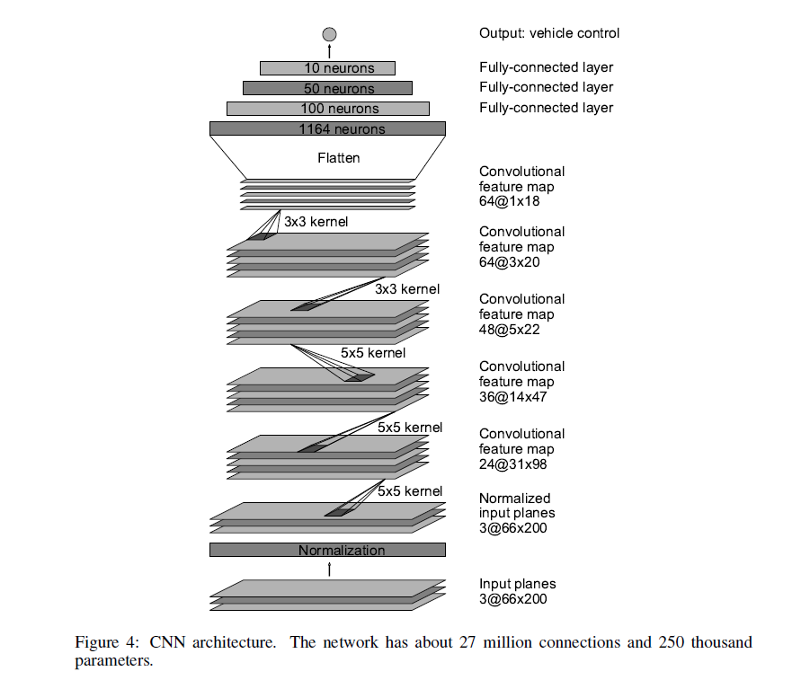

# Car-Racing-AI
#### Project by Jiadong Chen, Ke Yang

## Problem formulation

The objective of this project is to clone human driving behavior using a Deep Neural Network.

We trained a convolutional neural network (CNN) to map raw pixels from a screenshoot directly to steering commands.

We want to drive ourselves to let CNN learn our decisions.

We played the game with keyboard and we want cnn to imatate our play actions.

## Review of past techniques

There are many similar projects here. Udacity did a lot in this area. 

NIVIDIA trained their own model as a paper, and they get a good result to keep car stay in lane.

Also we found some similar github project such as <https://github.com/upul/Behavioral-Cloning>, <https://github.com/kevinhughes27/TensorKart>

Those github project were mostly run in the Linux or more customized environment, and those game/emulator environments are somekind easier than we choose. We will introduce that in the following part.

## Solution

We read lots of papers and materials, then found that most projects used the model of NIVIDIA's paper.

[1604.07316_End_to_End_Learning_for_Self-Driving_Cars](./1604.07316_End_to_End_Learning_for_Self-Driving_Cars.pdf)

Our main workload is to transfer this model to our own program as following.

### Dependencies

This project requires Python 3.6 and the following Python libraries installed: 
- [Tensorflow](https://www.tensorflow.org/)
- [keras](https://keras.io/)
- [scipy](https://www.scipy.org/)
- [Jupyter notebook(optional)](http://jupyter.org/)

Since screenshoot.py and play.py are developed to run in Windows system, you also need to install these dependencies on your windows OS.

Emulator:
Game: `Dirt4`/`Need for Speed - Shift 2`, these two games can be download from the platform `steam`.

Traning environment:
- Google Cloud Platform(GCP), with Instance: 
- n1-standard-4(4 vCPU，15 GB memory) CPU - Intel Haswell;
- 128 GB HardDisk;
- `GPU 1 x NVIDIA Tesla K80`;
- Ubuntu 16.04LTS;

Screenshoot environment(Dataset Prepareing environment):
- Windows 10 Home;
- Processor: i7-6700HQ
- RAM: 16.0GB
- System type: 64-bit OS

### Data Collecting

We uploaded a Youtube vedio to show this progress: <https://youtu.be/BrvNyYMC1dI>

Codes showed here:<./>

### Data Training

#### Network Architecture
We slightly changed the model in NIVIDIA's paper, we remove the MaxPooling layer since we think the time cost is resonable enough to accept. We used about 12000 pictures to train the model and estimated 80s for one epoch finished.

The network of NIVIDIA's shows here:

#### Run the training program
We uploaded a Youtube vedio to show this progress: <https://youtu.be/lPpNMeaECYk>

Codes showed here:<./>

### Run the model:

We uploaded a Youtube vedio to show this progress:<>

Go to `cmd`, `cd` to where `play.py` located, input `python play.py`

## Evaluation

W

