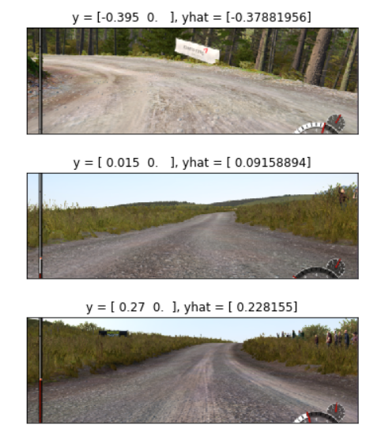

# Car-Racing-AI
#### Project by Jiadong Chen, Ke Yang

## Problem formulation

The objective of this project is to clone human driving behavior using a Deep Neural Network.

We trained a convolutional neural network (CNN) to map raw pixels from a screenshoot directly to steering commands.

We want to drive ourselves to let CNN learn our decisions.

We played the game with keyboard and we want cnn to imatate our play actions.

## Review of past techniques

There are many similar projects here. `Udacity` did a lot in this area. 

`NIVIDIA` trained their own model as a paper, and they get a good result to keep car stay in lane.

Also we found some similar github project such as <https://github.com/upul/Behavioral-Cloning>, <https://github.com/kevinhughes27/TensorKart>

Those github project were mostly run in the Linux or more customized environment, and those game/emulator environments are somekind easier than we choose. We will introduce that in the following part.

## Solution

We read lots of papers and materials, then found that most projects used the model of NIVIDIA's paper.

[1604.07316_End_to_End_Learning_for_Self-Driving_Cars](./1604.07316_End_to_End_Learning_for_Self-Driving_Cars.pdf)

Our main workload is to transfer this model to our own program as following.

If you want to run our program, you need to download:
- [Car_Racing_AI.py](./Car_Racing_AI.py)
- [data_collection.py](./data_collection.py)
- [train.ipynb](./train.ipynb)
- [play.py](./play.py)
- [press_release_keyboard](./press_release_keyboard)

### Dependencies

This project requires Python 3.6 and the following Python libraries installed: 
- [Tensorflow](https://www.tensorflow.org/)
- [keras](https://keras.io/)
- [scipy](https://www.scipy.org/)
- [Jupyter notebook](http://jupyter.org/)

Since screenshoot.py and play.py are developed to run in Windows system, you also need to install these dependencies on your windows OS.

Emulator:
Game: `Dirt4`/`Need for Speed - Shift 2`, these two games can be download from the platform `steam`.

Traning environment:
- Google Cloud Platform(GCP), with Instance: 
- n1-standard-4(4 vCPU，15 GB memory) CPU - Intel Haswell;
- 128 GB HardDisk;
- `GPU 1 x NVIDIA Tesla K80`;
- Ubuntu 16.04LTS;

Screenshoot environment(Dataset Prepareing environment):
- Windows 10 Home;
- Processor: i7-6700HQ
- RAM: 16.0GB
- System type: 64-bit OS

### Data Collecting

In data collection part, we mainly do three things: `screenshot`, `keyboard detection`, `image processing`. Multithreading is widely applied in this project cause we are facing a lot of blocking funcitons.

A screenshot takes about 0.02 seconds so we do not regard it as a blocking function. We put it `inside the thread` of keyboard detection to make sure they two `aligned`.

Keyboard detection is using a thread, cause it must be blocking, the reason is, it is designed to get probability of a key (left or right, in detail) in a 0.3 second time period. In this 0.3 second, it would check the keyboard 200 times, in each of these 200 times, a pressed left key would be `-1`, a released key would be `0`, a pressed right key would be `1`, and those -1s, 0s and 1s would be averaged, and be appended as a float number into a list we called it `y`. 

Image processing is using a thread, cause it is also blocking. The screenshot is sliced and suppressed to a much smaller size. This thread works by dectecting the newest saved screenshot, then process it, then replace the origin one. The process of deleting and saving images takes some time, but since it is an independent thread, so we don't take extra time.

`The index of corresponding image would be converted into string format and be zero-padding until it gains a length of 5, then this string + '.bmp' would be the file name of corresponding image.`This one-to-one map also provide robustness when part of images are deleted. Because we will try to load image with an incrementing file name. If there is any missing image, its corresponding y would be deleted. This provided great convinence while debugging.

A little thread is used to limit the car speed in a relatively narrow interval. 

Last but not least, a control thread is used to start, pause, and kill the other threads. We `press O to start`, `P to pause`, and `L to kill`. This helped a lot while debugging.

We uploaded a Youtube vedio to show how to collect data: <https://youtu.be/LSzj2XZ5_7s>

Codes showed here:
- [Car_Racing_AI.py](./Car_Racing_AI.py)
- [data_collection.py](./data_collection.py)

### Data Training

#### Network Architecture
We slightly changed the model in NIVIDIA's paper, we remove the MaxPooling layer since we think the time cost is resonable enough to accept. We used about 12000 pictures to train the model and estimated 80s for one epoch finished.

The network of NIVIDIA's shows here:

We use Kera's with Tensorflow to build our own deep CNN Model. 
We choose `SGD` to be our `optimizer` and `MSE` to be the `loss`.

#### Run the training program
We uploaded a Youtube vedio to show this progress: <https://youtu.be/lPpNMeaECYk>

Codes showed here: 
- [train.ipynb](./train.ipynb)

We run about 7 epochs and the result is good enough(val_loss is around 0.03, val_mean_absolute_error is around 0.14)

### Run the model:

In play part, we mainly do four things: `screenshot`, `image processing`, `predict`, `asynchronous keyboard control`. 

Screenshot is using almost the same thread as we used in data collecting. One difference is, we don't need to check the keyboard anymore. Another difference, the images are not saved by their index, instead they are temp bmp file, which would be covered by following images, and deleted when the thread killed.

Image processing is not an independent thread anymore, because processed image must be real-time and depend on the latest screenshot. It is enclosed in screenshot thread this time. The way we process image is the same when we collect data sets, of course.

Predict is also included in the thread above, cause predict must depend on processed data. They three can consume 0.10 second altogether, meaning we refresh our prediction every 0.1s. This is acceptable. Prediction uses the model we trained and the prediction result would be stored in a variable y_pred. 

Asynchronous keyboard control is an independent thread. It determines which key to press(left or right) by looking at y_pred. More importantly, it drives the keyboard press ratio, to converge to the ideal ratio, in 0.0001 second precision, by comparing the ideal ratio to history ratio. It will also check if y_pred is changed in each loop, if so, all history would be cleared and parameters would be updated, so it would behave according to the new y_pred, otherwise it would behave according to the current y_pred, even if it have no idea when next instruction (change of y_pred) would come.

The same little thread is used to limit the car speed in a relatively narrow interval. 

We uploaded a Youtube vedio to show this progress:<https://youtu.be/dZqdCnPsczU>

Go to `cmd`, `cd` to where `play.py` located, input `python play.py`

Codes showed here:
- [Car_Racing_AI.py](./Car_Racing_AI.py)
- [play.py](./play.py)

## Evaluation

You can watch our play.py vedio:<https://youtu.be/dZqdCnPsczU>
Or Simply show you some of the prediction in different games.

`NEED FOR SPEED 15:` 

`Dirt4:`

## Conclusions and Future Directions

Actually we met so many problems in the project but we can't list here one by one.
We thought a lot to improve the result.
At the beginning we stuck at the point how to collect data set： how to compare and match between screenshoot and keyboard value.
Then we were so confused on model selection and optimizer selection - They didn't work all the time in different environment and problems.

Through the result we found that CNN performs good to find some 'rule' to clone humans driving behaviour(even the way that cut the curve to race as me!)

